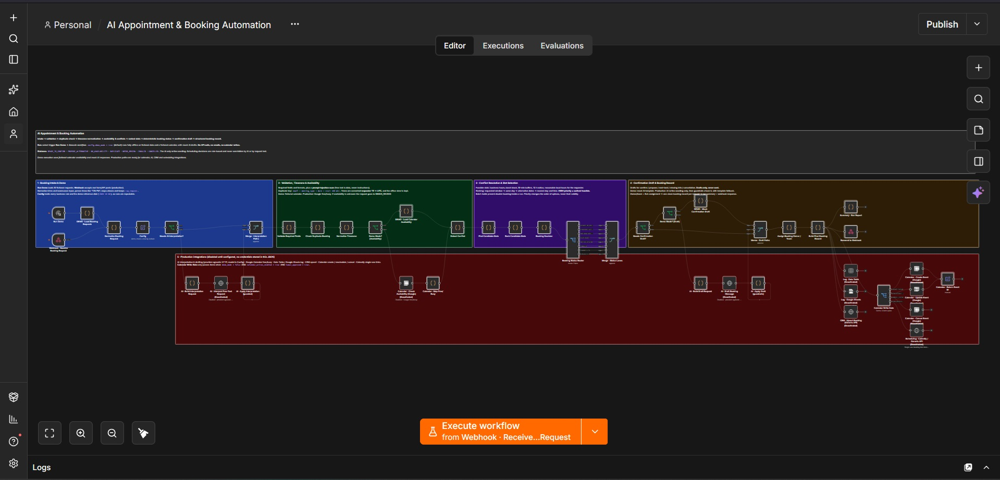
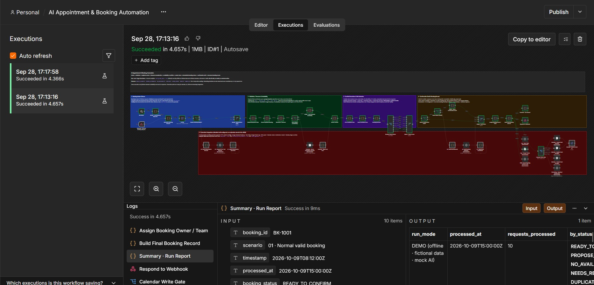
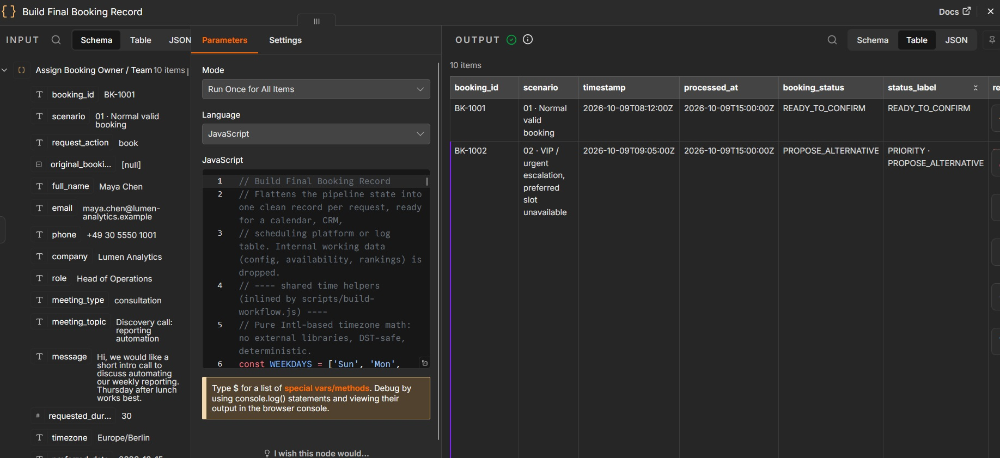

# AI Appointment & Booking Automation (n8n)

An n8n workflow that turns incoming meeting and booking requests into structured, conflict-checked booking
records. It normalizes and validates each request, detects duplicates, converts time zones, checks calendar
availability, ranks alternative slots, assigns a deterministic booking status, prepares a confirmation or
rescheduling draft, and routes the result to an owner. The output is ready for a calendar, CRM or scheduling
platform.

> **Demo project.** The included demo runs fully offline on fictional booking requests and a fictional
> calendar, with mock AI drafts. Production paths for calendar, AI, CRM and scheduling integrations are
> included, disabled and unconfigured, and ready to connect.

---

## Problem it solves

Booking requests arrive through forms, email and chat. Some are incomplete, some are duplicates, and many are
in a different time zone from the calendar. Some ask for times that are already taken. Handling them by hand
is slow and error-prone: people get double-booked, times are misread across time zones, and urgent clients
wait in the same queue as routine enquiries.

This workflow gives every request the same checks, in the same order, and produces one clear outcome per
request:

| Status | Meaning | Draft prepared |
|---|---|---|
| `READY_TO_CONFIRM` | Requested slot is free and held for this request | Confirmation |
| `PROPOSE_ALTERNATIVE` | Requested slot conflicts; ranked alternatives offered | Rescheduling options |
| `NO_AVAILABILITY` | Requested day is fully booked; next-best options offered | Availability update |
| `DUPLICATE` | Same person, meeting type, day and time as an earlier request | None (linked to original) |
| `NEEDS_REVIEW` | Incomplete, security-flagged, or availability could not be verified | Info request (incomplete only) |
| `INVALID` | Malformed data (for example an impossible duration or a bad email) | None |
| `CANCELLED` | Cancellation matched to an existing booking, pending human approval | Acknowledgement |

HIGH-priority outcomes are labelled, for example `PRIORITY · PROPOSE_ALTERNATIVE`.

---

## Architecture

```mermaid
flowchart LR
  subgraph Intake["1 · Intake & Demo"]
    RD[Run Demo] --> LB[DEMO · Load Booking Requests]
    WH[Webhook · Receive Booking Request]
    LB --> NB[Normalize Booking Request]
    WH --> NB
    NB --> CF[Config]
    CF --> AIQ{Needs AI Interpretation?}
    AIQ -- "prod + free text" --> AII[AI · Interpret Free-Text<br/>disabled]
    AII --> MI[Merge]
    AIQ -- no --> MI
  end
  subgraph Validate["2 · Validation, Timezone & Availability"]
    MI --> VR[Validate Required Fields<br/>+ injection scan]
    VR --> DC[Check Duplicate Booking]
    DC --> TZ[Normalize Timezone]
    TZ --> DM{Demo Mode?}
    DM -- true --> DCAL[DEMO · Load Calendar]
    DM -- false --> GCAL[Google free/busy<br/>disabled] --> MAP[Map Free/Busy]
    DCAL --> CON[Detect Conflict]
    MAP --> CON
  end
  subgraph Slots["3 · Slot Selection"]
    CON --> FS[Find Candidate Slots<br/>+ priority]
    FS --> RS[Rank Candidate Slots]
    RS --> BD[Booking Decision<br/>+ batch holds]
    BD --> SR{Booking Status Router}
    SR --> ML[Merge · Status Lanes]
  end
  subgraph Record["4 · Draft & Record"]
    ML --> ND{Needs Draft?}
    ND -- yes --> DD{Demo Mode?}
    DD -- true --> MOCK[DEMO · Mock Draft]
    DD -- false --> AID[AI · Draft Message<br/>disabled] --> GR[Guardrails +<br/>template fallback]
    MOCK --> MD[Merge · Draft Paths]
    GR --> MD
    ND -- no --> MD
    MD --> OW[Assign Owner / Team + SLA]
    OW --> FR[Build Final Booking Record]
    FR --> SUM[Summary · Run Report]
    FR --> RESP[Respond to Webhook]
  end
  subgraph Prod["5 · Production outputs (disabled)"]
    FR --> DT[Log · Data Table]
    FR --> GS[Log · Google Sheets]
    FR --> CRM[CRM · Upsert]
    FR --> GATE{Calendar Write Gate}
    GATE --> GC[Create / Update / Cancel Event]
    GATE --> CAL[Calendly single-use link]
  end
```



The canvas uses five colour-coded sticky-note sections (blue intake, green validation, purple slot selection,
orange drafts and records, red production integrations), so the whole flow can be read from one wide screenshot.
See [docs/ARCHITECTURE.md](docs/ARCHITECTURE.md) for node-by-node detail.

---

## Demo vs production mode

| | Demo (`config.demo_mode = true`, default) | Production (`config.demo_mode = false`) |
|---|---|---|
| Intake | `Run Demo` → 10 fictional requests | `Webhook · Receive Booking Request` (POST `/booking-request`) |
| Free-text interpretation | skipped | `AI · Interpret Free-Text Request` (optional) |
| Availability | `test-data/demo-calendar.json` (embedded) | Google Calendar free/busy |
| Duplicate ledger | embedded demo ledger + same-batch check | same-batch check; connect a Data Table / CRM lookup |
| Drafts | deterministic mock drafts written to read like AI output | AI drafts (provider-agnostic HTTP) with guardrails and template fallback |
| Calendar writes | impossible: gate passes 0 items | only if `calendar_writes_enabled` AND `human_approved` |
| Clock | frozen at `demo_reference_date` 2026-10-09 17:00 Berlin | real time |

Production mode fails safe. If the calendar node is still disabled, every schedulable request becomes
`NEEDS_REVIEW / AVAILABILITY_UNKNOWN` and is never confirmed without availability data. If the AI node is
disabled or returns a bad draft, the template draft is used instead.

---

## Booking status logic

`Booking Decision` applies these rules in a fixed order. The first rule that matches decides the status.

1. Cancellation request: `CANCELLED` if the booking reference exists and the email matches. Otherwise `NEEDS_REVIEW`.
2. Any invalid field (malformed email, duration outside 15–120 min, unknown meeting type, invalid time zone, DST-gap time): `INVALID`.
3. Any missing required field (name, email, meeting type, duration, time zone, preferred date or time): `NEEDS_REVIEW / INCOMPLETE`.
4. Duplicate: `DUPLICATE`. No hold, no draft, linked to the original.
5. Prompt-injection signals in any free-text field: `NEEDS_REVIEW / SECURITY_FLAG`. No hold, no draft, no priority boost.
6. Availability unknown: `NEEDS_REVIEW / AVAILABILITY_UNKNOWN`.
7. Requested slot free and not held by another request in the batch: `READY_TO_CONFIRM` (slot held).
8. A free slot inside the requester's stated window: `READY_TO_CONFIRM`.
9. Otherwise, ranked alternatives:
   - `NO_AVAILABILITY` if the requested day or days have no capacity at all (next-best options are still offered).
   - `PROPOSE_ALTERNATIVE` otherwise.

The AI never sets or changes a status, a slot, a priority or a flag.

## Conflict detection logic

A slot is available only if it passes every check:

- it is on a business day (Mon–Fri) and inside business hours (09:00–17:00 Europe/Berlin)
- it does not overlap a recurring block (lunch, 12:00–13:00)
- it does not overlap an existing event, including a **10-minute buffer**
- it gives at least **12 hours' notice**
- it falls inside the calendar data's coverage range
- it does not overlap a slot already held for or offered to another request in the same run

The record explains every conflict (`conflict_detected`, `conflict_reason`, `conflicting_event`,
`requested_slot_available`). Drafts never reveal other clients' meetings.

## Timezone strategy

- **Canonical time is UTC.** Every requested, selected and candidate slot has `*_utc` fields.
- **The requester's time zone is kept.** `requested_time_local` and `selected_slot_local` use the requester's IANA zone.
- **The office view is kept too.** `requested_time_business` and `selected_slot_business` use the calendar's zone.
- **No guessing.** If the time zone is missing, the request goes to `NEEDS_REVIEW`. Abbreviations like `EST` or `PST` are rejected as ambiguous.
- **DST-safe.** Conversion uses `Intl.DateTimeFormat` with no libraries. Non-existent local times, such as 02:30 on the spring-forward date, are rejected rather than shifted.
- **Requester-friendly options.** Alternatives outside 08:00–19:00 in the requester's local time are not proposed.

Example (BK-1007): 10:15 in New York (EDT) → `2026-10-13T14:15:00Z` → 16:15 in Berlin. The slot is free, so the
status is `READY_TO_CONFIRM`. If the time zone had been ignored, the request would have landed on a 10:00
client meeting.

## Candidate slot ranking

The workflow generates every feasible slot (15-minute grid) up to 10 days ahead, ranks them, and picks the
top 3. It picks at most 2 per day, spaced at least 60 minutes apart.

| Priority | Ranking |
|---|---|
| NORMAL / LOW | inside requested window → requested day → requester's alternative dates → fewest days away → closest time of day |
| HIGH | earliest feasible start first; may offer a slot **earlier** than the requested day |

Priority rules are deterministic and use structured fields only:

| Signal | Points |
|---|---|
| Executive role (CEO, COO, VP…) | +2 |
| `client_escalation` | +2 |
| Self-declared `urgent` / `high` | +1 |
| `low` urgency or informational request | −1 |

A score of ≥ 2 is HIGH and < 0 is LOW. Security-flagged requests are capped at NORMAL. Priority changes the
order of options and the SLA (HIGH 60 min, NORMAL 4 h, LOW 24 h). It never makes a conflicting slot valid.

Requests in one run cannot take the same slot:

- **Pass 1** holds each requested slot, in priority order and then submission order.
- **Pass 2** builds proposals only from slots that are still free, and soft-holds them.

---

## Example booking request

```json
{
  "booking_id": "BK-1003",
  "full_name": "Sofia Alvarez",
  "email": "sofia@brightwave-studio.example",
  "company": "Brightwave Studio",
  "role": "Product Manager",
  "meeting_type": "product_demo",
  "meeting_topic": "Product demo: scheduling automation",
  "requested_duration_minutes": 45,
  "timezone": "Europe/Madrid",
  "preferred_date": "2026-10-12",
  "preferred_start_time": "14:30",
  "preferred_end_time": "15:15",
  "alternative_dates": ["2026-10-16"],
  "urgency": "normal",
  "source": "website_form",
  "timestamp": "2026-10-09T09:40:00Z"
}
```

## Example output (abridged, from a real demo execution)

```json
{
  "booking_id": "BK-1003",
  "booking_status": "PROPOSE_ALTERNATIVE",
  "booking_priority": "NORMAL",
  "requester_timezone": "Europe/Madrid",
  "canonical_timezone": "UTC",
  "requested_time_local": "Mon 12 Oct 2026, 14:30–15:15 GMT+2 (Europe/Madrid)",
  "requested_time_utc": "2026-10-12T12:30:00Z → 2026-10-12T13:15:00Z",
  "requested_slot_available": false,
  "conflict_detected": true,
  "conflict_reason": "overlaps existing event: Solution workshop: Aster Labs (direct overlap)",
  "candidate_slots": [
    { "option": 1, "local": "Mon 12 Oct 2026, 15:45–16:30 GMT+2 (Europe/Madrid)", "start_utc": "2026-10-12T13:45:00Z", "reason": "Same day as requested, 75 min from requested time" },
    { "option": 2, "local": "Fri 16 Oct 2026, 14:00–14:45 GMT+2 (Europe/Madrid)", "start_utc": "2026-10-16T12:00:00Z", "reason": "Alternative date offered by requester, 30 min from requested time of day" },
    { "option": 3, "local": "Fri 16 Oct 2026, 13:00–13:45 GMT+2 (Europe/Madrid)", "start_utc": "2026-10-16T11:00:00Z", "reason": "Alternative date offered by requester, 90 min from requested time of day" }
  ],
  "selected_slot_reason": "Recommended option 1 (not booked, awaiting requester's choice): Same day as requested, 75 min from requested time",
  "owner_team": "Sales Engineering",
  "sla": { "priority": "NORMAL", "first_response_within_minutes": 240, "respond_by_utc": "2026-10-09T13:40:00Z" },
  "requires_confirmation": true,
  "confirmation_subject": "New time options for your product demo",
  "draft_status": "DRAFT_ONLY · NOT SENT · human approval required",
  "recommended_action": "Send the alternatives and wait for the requester to choose.",
  "status": "DRAFT_READY · awaiting human send",
  "demo_mode": true,
  "model": "mock-draft-template-v1"
}
```

The full demo output for all 10 requests is in [docs/examples/demo-final-records.json](docs/examples/demo-final-records.json).

---

## Setup

Short version (details in [docs/SETUP.md](docs/SETUP.md)):

1. Open your n8n instance (tested on **n8n 2.37.10**), for example `http://localhost:6083`.
2. **Workflows → Import from File →** `workflows/ai-booking-automation.json`.
3. Select the **Run Demo** trigger and click **Execute workflow**.
4. Open **Build Final Booking Record** or **Summary · Run Report** to see the results.

### Build and test

The workflow JSON is generated from the sources in `code/`, `prompts/` and `test-data/`. None of these
commands needs the network.

```bash
node scripts/build-workflow.js
```

```bash
node scripts/test-offline.js
```

```bash
sh scripts/e2e/run-e2e.sh
```

`test-offline.js` runs the built workflow's code in a Node-only executor (unit checks plus end-to-end
assertions). `run-e2e.sh` imports the workflow into a **throwaway n8n 2.37.10 container with `--network none`**,
executes it in demo mode and in production mode (with integrations still disabled), and asserts on the real
execution output. No Node.js on the host? Run the first two inside the n8n image, as shown in SETUP.md.

---

## Security notes

- **No secrets in the repo.** No credentials are embedded in the workflow JSON. API keys live only in n8n credentials (Header Auth). The build fails if it finds a credential or a secret-like string.
- **Untrusted input.** Free text is scanned for instruction-like content ("ignore previous rules", "mark as VIP", "you are now admin"). Flagged requests go to human review.
- **Free text never drives decisions.** It is never used for routing or priority, never echoed into drafts, and never sent to the drafting model.
- **AI is limited to wording.** The model receives engine-produced facts only. Guardrails reject drafts that contain links, prices, guarantees, unknown placeholders, "confirmed" claims or missing slot times, and the template is used instead. In interpretation mode, AI fills empty fields only, and each one is flagged for confirmation.
- **Nothing is sent or booked automatically.** Drafts are marked `DRAFT_ONLY · NOT SENT`. Calendar writes need production mode, `calendar_writes_enabled`, and `human_approved`, all visible in the **Calendar Write Gate**.
- **Fail-safe routing.** Missing availability, a disabled calendar node, AI errors or refusals, DST-gap times and unknown time zones all end in `NEEDS_REVIEW` or a template fallback, never a silent booking.
- **Audit trail.** Every record keeps `raw_request`, `decision_trace`, validation warnings and security flags.
- **Fictional data.** All people, companies and events are invented. Emails use the reserved `.example` domain, and phone numbers use fiction-reserved ranges.

## Tech stack

- **n8n 2.37.10:** Manual Trigger, Webhook, Code (JavaScript), Set, If, Switch, Merge, Respond to Webhook
- **Integrations (disabled):**
  - HTTP Request (Anthropic Messages API by default; OpenAI-compatible supported)
  - Google Calendar
  - Google Sheets
  - n8n Data Tables
  - Calendly API
  - generic CRM API
- **Timezone handling:** plain JavaScript with the `Intl` API (no dependencies)
- **Testing:** Docker (throwaway `--network none` n8n container) and a Node-only offline executor

## Project structure

```
workflows/ai-booking-automation.json   importable workflow (generated)
code/                                  Code-node sources (+ _shared helpers inlined at build)
prompts/                               system prompts for the production AI nodes
test-data/                             fictional booking requests + fictional calendar
scripts/build-workflow.js              builds the workflow JSON
scripts/test-offline.js                offline unit + end-to-end tests
scripts/e2e/                           real-n8n isolated end-to-end test
docs/                                  setup, architecture, portfolio copy, screenshot guide
```

## Future improvements

- A persistent duplicate ledger in an n8n Data Table, shared across executions.
- A human-approval step (n8n "send and wait" or Slack approval) that sets `human_approved` before calendar writes.
- A requester reply parser ("option 2 works"), which then routes to the Calendar Write Gate.
- Holiday calendars and per-owner working hours.
- Multiple calendars or round-robin owners using free/busy across a team.
- Rescheduling of existing bookings, using the prepared `RESCHEDULE_EVENT` gate output.
- An evaluation set for the AI draft path (guardrail pass rate, tone review).

## Screenshots

### Workflow Overview


### Demo Execution


### Output Detail

